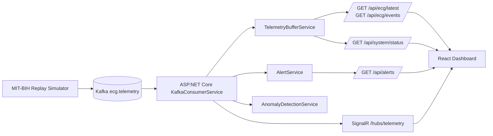

# CardioFlow Monitor

CardioFlow Monitor is a real-time ECG monitoring demo stack:

- **Simulator** replays MIT-BIH records (`100`, `101`, `103`) to Kafka
- **Backend** consumes telemetry, performs anomaly detection, and exposes REST + SignalR
- **Frontend** renders ECG chart, alerts, patient/device info, and event log


## Dashboard Screenshot


## Architecture



## Repository Structure

| Path | Purpose |
|------|---------|
| `backend/CardioFlow.Api/` | ASP.NET Core API, Kafka consumer, REST, SignalR |
| `frontend/dashboard/` | React + TypeScript + Vite dashboard |
| `simulator/mitbih-replay/` | Python MIT-BIH replay producer |
| `ai/explainer-service/` | FastAPI rule-based alert explanation service (`/health`, `/explain`) |
| `scripts/kafka/` | Docker Compose + topic bootstrap scripts |
| `docs/` | Architecture notes and screenshots |
| `docs/architecture/` | Service design documents |

## Prerequisites

- Docker + Docker Compose
- .NET SDK
- Node.js + npm
- Python 3.8+

## Quick Start

### 1) Start Kafka and create topics

```bash
cd scripts/kafka
docker compose up -d
cd ../..
scripts/kafka/ensure-topics.sh
```

### 2) Start backend

```bash
cd backend/CardioFlow.Api
dotnet restore
dotnet run --urls http://localhost:5050
```

### 3) Start simulator replay

```bash
cd simulator/mitbih-replay
python3 -m venv venv
source venv/bin/activate
pip install -r requirements.txt
export KAFKA_BOOTSTRAP_SERVERS=localhost:9092
python replay.py --record 100
```

To test other records:

```bash
python replay.py --record 101
python replay.py --record 103
```

### 4) Start frontend

```bash
cd frontend/dashboard
npm install
npm run dev
```

Frontend default URL: [http://localhost:5173](http://localhost:5173)

## CI/CD

### CI workflow

- File: `.github/workflows/ci.yml`
- Triggers:
  - `push` to `main` / `develop`
  - `pull_request` to `main` / `develop`
  - `workflow_dispatch`
- Path filters:
  - `backend/**`
  - `frontend/**`
  - `simulator/**`
  - `.github/workflows/**`

CI jobs:

- `backend-ci`: restore + build (`backend/CardioFlow.Api`)
- `frontend-ci`: `npm ci` + `npm run build` (`frontend/dashboard`)
- `simulator-ci`: pip install + `py_compile` (`simulator/mitbih-replay`)

### Deploy workflows

- Frontend: `.github/workflows/deploy-frontend.yml`
  - Trigger: `push` to `main` (frontend paths) or manual dispatch
  - Target: Vercel
- Backend: `.github/workflows/deploy-backend.yml`
  - Trigger: `push` to `main` (backend paths) or manual dispatch
  - Target: Render (Deploy Hook)

## GitHub Secrets

Configure in: **GitHub repo -> Settings -> Secrets and variables -> Actions**

Required or optional keys used by workflows:

- `FRONTEND_DEPLOY_TOKEN` (Vercel token)
- `FRONTEND_ORG_ID` (Vercel org id)
- `FRONTEND_PROJECT_ID` (Vercel project id)
- `VITE_API_BASE_URL_PROD` (frontend build-time API URL)
- `VITE_SIGNALR_URL_PROD` (frontend build-time SignalR URL)
- `BACKEND_DEPLOY_TOKEN` (Render Deploy Hook URL)

## Live Demo

| Service | URL |
|---|---|
| Frontend (Vercel) | [https://cardioflow-monitor-gcqv.vercel.app](https://cardioflow-monitor-gcqv.vercel.app) |
| Backend API (Render) | [https://cardioflow-monitor-1.onrender.com](https://cardioflow-monitor-1.onrender.com) |

## Current deployment snapshot

Baseline for the `feature/llm-k8s-upgrade` workstream:

- **Frontend** is deployed on **Vercel** (URL in the table above).
- **Backend** is deployed on **Render** (URL in the table above).
- **Kafka cloud migration** is in progress (hosted broker and simulator topology are evolving).
- **AI explanation service** is planned; API contract and boundaries are documented in `docs/architecture/explainer-service-design.md`.

Verify the live API after cold start:

```bash
curl -sS "https://cardioflow-monitor-1.onrender.com/api/system/status"
```

> **Note:** The backend runs on Render's free tier and may take ~50 seconds to wake up after inactivity.
> Current scope: frontend on Vercel, backend on Render (simulator may remain local or move to a worker — live Kafka feed depends on your cloud setup).

## Frontend Environment Variables

- `VITE_API_BASE_URL` (default: `http://localhost:5050`)
- `VITE_SIGNALR_URL` (default: `http://localhost:5050/hubs/telemetry`)

## Backend API Overview

### System status

- `GET /api/system/status`
- Includes: `streamStatus`, `activePatient`, `activeRecordId`, `bufferCount`, `lastMessageAt`

### ECG data

- `GET /api/ecg/latest?count=500&recordId=100`
- `GET /api/ecg/window?count=800&windowSeconds=5&recordId=101&downsample=2`
- `GET /api/ecg/events?count=30&recordId=103` (latest first, event-log friendly)

### Alerts

- `GET /api/alerts?count=20&recordId=100`
- Returns timestamp-desc alerts with `severity`, `message`, and `heartRate`

### Patient snapshot

- `GET /api/patients/current`

## Record Switching Behavior

- Supported records: `100`, `101`, `103`
- Dashboard record selector reloads record-scoped REST data
- SignalR updates are filtered on the client by selected `recordId`
- Invalid `recordId` on backend APIs returns `400`

## Health Checks

Use these commands to verify data flow:

```bash
curl -sS "http://localhost:5050/api/system/status"; echo
curl -sS "http://localhost:5050/api/ecg/latest?recordId=100&count=5"; echo
curl -sS "http://localhost:5050/api/ecg/events?recordId=100&count=5"; echo
curl -sS "http://localhost:5050/api/alerts?recordId=100&count=5"; echo
```

If all arrays are empty and `streamStatus=stopped`, simulator is likely not publishing or Kafka/consumer is disconnected.


## Troubleshooting

- **Port 5050 already used**: `lsof -i :5050`
- **No telemetry received**:
  - verify simulator terminal is actively sending samples
  - verify Kafka topic exists (`ecg.telemetry`)
  - verify backend logs show consumer activity
- **Frontend connected but no updates**:
  - verify `VITE_SIGNALR_URL` (or fallback `VITE_SIGNALR_HUB_URL`)
  - check browser console for SignalR reconnect/disconnect logs
- **CI fails on wrong paths**:
  - verify workflow `working-directory` values match repository structure
- **CI fails on SDK/Node mismatch**:
  - align local versions with workflow (`.NET 10`, `Node 20`, `Python 3.11`)
- **Deploy fails with missing secrets**:
  - ensure all required keys exist in GitHub Actions secrets
- **Deploy uses wrong backend URL**:
  - verify `VITE_API_BASE_URL_PROD` and `VITE_SIGNALR_URL_PROD` point to your live backend