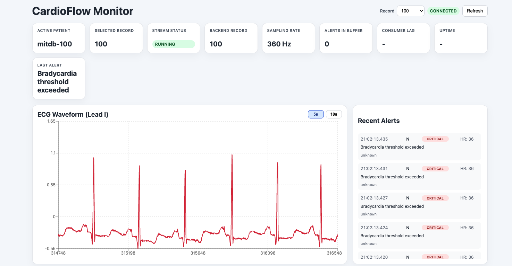

# Frontend

CardioFlow frontend is a React + TypeScript + Vite single-page dashboard for realtime ECG monitoring.

## Live Demo

🖥️ **[https://cardioflow-monitor-gcqv.vercel.app](https://cardioflow-monitor-gcqv.vercel.app)**

> The frontend connects to the backend at [https://cardioflow-monitor-1.onrender.com](https://cardioflow-monitor-1.onrender.com).
> The backend runs on Render's free tier and may take ~50 seconds to wake up after inactivity.

## Features

- Summary cards for stream/patient status
- ECG chart with rolling window rendering
- Alert panel with severity styling and heart-rate context
- Patient/device card (patient ID, record ID, battery, signal quality)
- Event log viewer (recent telemetry summary)
- Record selector for `100`, `101`, `103`

## Quick Start

```bash
cd frontend/dashboard
npm install
npm run dev
```

Frontend URL: [http://localhost:5173](http://localhost:5173)

## Environment Variables

- `VITE_API_BASE_URL` (default: `http://localhost:5050`)
- `VITE_SIGNALR_HUB_URL` (default: `http://localhost:5050/hubs/telemetry`)
- `VITE_SIGNALR_URL` is **not used**; keep using `VITE_SIGNALR_HUB_URL`

Optional `.env.local` example:

```bash
VITE_API_BASE_URL=http://localhost:5050
VITE_SIGNALR_HUB_URL=http://localhost:5050/hubs/telemetry
```

## Data Flow

- **REST** for initial data load after page refresh or record switch
- **SignalR** for incremental realtime updates
- **Client-side record filter** prevents mixed-record rendering after switching

## Data Dependencies

- `GET /api/system/status`
- `GET /api/ecg/latest`
- `GET /api/alerts`
- `GET /api/patients/current`
- `SignalR /hubs/telemetry` events: `ReceiveTelemetry`, `ReceiveAlert`, `ReceiveSystemStatus`

## Component Data Sources

| Component | REST source | SignalR source | Notes |
|---|---|---|---|
| `SummaryCards` | `/api/system/status` | `ReceiveSystemStatus` | Uses fallback values when new fields are absent |
| `EcgChart` | `/api/ecg/latest` | `ReceiveTelemetry` | Client-side record filter and rolling window retention |
| `AlertPanel` | `/api/alerts` | `ReceiveAlert` | Timestamp-desc, top insert, dedupe, max 50 |
| `PatientCard` | `/api/patients/current` | `ReceiveTelemetry` (fallback) | Falls back to latest telemetry + status when patient endpoint is empty |
| `EventLogViewer` | `/api/ecg/latest` subset | `ReceiveTelemetry` | Renders minimal summary even with partial fields |

## SignalR Event Contracts (Minimum)

- `ReceiveTelemetry`: `timestamp`, `sampleIndex`, `lead1`, `recordId`
- `ReceiveAlert`: `timestamp`, `sampleIndex`, `severity`, `message`, `sourceRule`
- `ReceiveSystemStatus`: `streamStatus`, `samplingRate`, `activePatient` (extended fields optional)

## Data Contract (Frontend View)

### TelemetryMessage

- Required: `patientId`, `recordId`, `deviceId`, `timestamp`, `sampleIndex`, `lead1`, `annotation`, `status`
- Nullable/optional: `receivedAt`, `heartRate`, `signalQuality`, `battery`, `rrIntervalMs`, `isDerived`, `derivedMetrics`

### AlertMessage

- Required: `patientId`, `recordId`, `deviceId`, `timestamp`, `sampleIndex`, `severity`, `message`, `sourceRule`
- Nullable/optional: `receivedAt`, `annotation`, `heartRate`, `rrIntervalMs`, `metadata`

### SystemStatus

- Required: `streamStatus`, `samplingRate`, `topic`, `activePatient`, `activeRecordId`, `bufferCount`
- Extended: `alertCount`, `lastMessageAt`, `lastAlertAt`, `consumerLagApprox`, `uptimeSeconds`

## Nullable UI Rules

- `heartRate` -> `--`
- `battery` -> `--%`
- `signalQuality` -> `unknown`
- `rrIntervalMs` -> `-- ms`
- nullable time fields -> `-`
- missing alert `message` -> `Abnormal ECG event`
- missing alert `sourceRule` -> `unknown`

## API Error Handling Strategy

- All REST requests pass through one request wrapper in `api.ts`
- Errors are wrapped with endpoint context (`API request error: ...`)
- Runtime contract parsing uses fallback defaults instead of throwing
- In development mode, contract mismatch logs a warning in console

## API Snapshot Examples (Frontend View)

System status snapshot:

```json
{
  "streamHealth": "healthy",
  "streamStatus": "running",
  "lastMessageTimestamp": "2026-03-20T21:45:11.102Z",
  "currentRecord": "100",
  "telemetryCount": 1000,
  "alertCount": 28,
  "samplingRate": 360,
  "topic": "ecg.telemetry",
  "activePatient": "mitdb-100",
  "lastAlert": "Short RR interval detected"
}
```

Alert snapshot:

```json
{
  "timestamp": "2026-03-20T21:45:11.102Z",
  "sampleIndex": 315240,
  "annotation": "N",
  "heartRate": 110,
  "rrIntervalMs": 382.6,
  "severity": "warning",
  "message": "Short RR interval detected",
  "sourceRule": "rr_interval_rule",
  "patientId": "mitdb-100",
  "recordId": "100",
  "deviceId": "ecg-sim-01"
}
```

## Record Switching Behavior

- Selector options: `100`, `101`, `103`
- On switch, dashboard resets chart/event/alert buffers
- Then reloads:
  - `/api/ecg/latest?recordId=...`
  - `/api/alerts?recordId=...`
  - `/api/system/status`
  - `/api/patients/current`

## Demo Checklist

1. Start Kafka
2. Start backend API
3. Start simulator replay with selected record
4. Start frontend
5. Verify:
   - chart updates for selected record only
   - alerts and event logs follow selected record
   - patient card record ID matches selector

## Screenshot Checklist

Save screenshots under `docs/screenshots/`:

- `dashboard-overview.png` (record `100`, active chart)
- `dashboard-alerts.png` (warning/critical alerts visible)
- `dashboard-record-101.png` (after switching to record `101`)

Current overview screenshot:



## Troubleshooting

- **Backend not started**
  - UI shows request error notice
  - Existing cached panels remain in empty/default state
- **Kafka has no data**
  - status likely `stopped/down`, chart empty, alerts empty
- **SignalR disconnected/reconnecting**
  - connection badge changes to `disconnected`/`reconnecting`
  - REST refresh still works
- **REST returns empty arrays**
  - chart/event/alerts show empty states without crashes

## Backend Integration Flow

Run order: **Kafka -> backend -> simulator -> frontend**.

- If backend is down: dashboard shows notice + empty/fallback cards.
- If backend up but no replay: chart/alerts/event log stay empty; status may be `stopped/down`.

## Quick Verification

After frontend starts, verify:

1. SummaryCards shows stream status/health fields (or fallback values)
2. ECG chart begins rendering after replay starts
3. AlertPanel receives live alerts and inserts newest on top
4. Record switch (`100/101/103`) isolates data by `recordId`

## Integration Checklist

### 1) Backend has data

- ECG chart updates continuously
- Alert list shows severity/message/sourceRule
- Patient card shows record/patient/device and RR placeholder or value

### 2) Backend has no data

- No white screen
- ECG empty state shows
- Alert panel shows `No alerts`
- Event log shows `No telemetry events yet`

### 3) Missing/nullable fields

- UI falls back to placeholder values (`--`, `--%`, `unknown`, `-`)
- No runtime crash in components

### 4) SignalR reconnect

- Connection badge changes state (`reconnecting` / `disconnected` / `connected`)
- UI remains interactive while reconnecting
